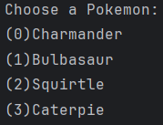
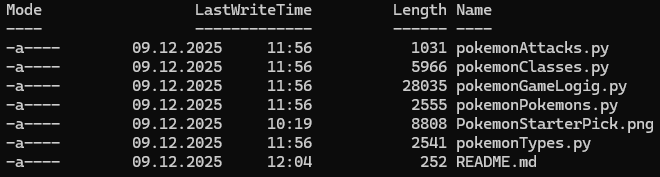

# What is the point of this repository?

This repository focuses on rewriting my previous project and making it more readable but also to get more familiar with git (and GitHub).  

# What was my previous project?

My previous project was a ***work*** related task where i needed to programm a functioning *Pokemon* combat system to get more familiar with OOP. The *game* is console only and therefore has no GUI (which is a result of the project lasting only 3 1/2 days)

# What needs to be rewritten?

Due to time constraints (and also me being stupid lol) the code has still a few minor bugs, has quite a lot of redundant code and is pretty unreadable. To put it in a nutshell **most** of the code needs to be rewritten /: 

# How does the game work?

Basically there are 4 starter *Pokemons* with 4 attacks each (a few of them are placeholders like the *Poison Powder* attack).

  

You start by choosing two of those four (your opponent receives the remaining *Pokemons*). Afterwards the fight starts and the first turn is decided by the *Pokemons* **speed** stat. You can either attack or switch *Pokemons* and the rest works like a standard *Pokemon* fight

# What has been changed?


## Splitting `pokemon.py` into mulitple files

A good half of code consisted of `class` and `object` declarations so it made sense to split them into seperate files for better readability. 



I later realized that doing this caused a problem unfamiliar to me which was called *circular imports*. This issue is caused by atleast two files importing (and therefore being dependent on) each other. Essentially what happens is that the files are importing each other in an infinite loop which Python detects and breaks automatically (and therefore not actually importing each other which leads to e.g. `variables` and `functions` (which were supposed to be imported) not being declared). I fixed this by combining the `pokemonClasses.py` and the `pokemonTypes.py` files into one so they aren't depended on each other anymore (or just within the same file)

## Reducing redundance by adding a bunch of functions

Originally a lot of the code was pretty redundand (and also really unreadable due to the constant `if`, `elif` and `else` nesting) so i decided to *fix* it by adding a bunch of functions to each code segment

**Example:**

Previously

```python
# (...) previous nested code
if playerPokemonHP <= 0:
  print(f"{playerPokemon.name} was defeated!")
  playerPokemonAlive = False
  break # breaks out of the combat loop
# (...) following more nested code
```

Now

```python
# Instead of nested code, this function gets called after the player takes damage
def checkPlayerAlive():
  if playerPokemonHP <= 0:
      print(f"{playerPokemon.name} was defeated!")
      return False
  else:
      return True
```

Changing this did cause a few *problems* though. Mainly these there scope issues which resulted into `UnboundLocalError`'s. Basically what happens is that `variables` despite being declared outside of any local scope and therefore having a global scope aren't being assigned inside a `function`'s local scope and therefore do not have a value inside the `function`. The solution to fixing this was to add the `global` statement to each `variable` to each `function` so they are being assigned inside the `function`'s local scope

```python
def playerStatusAlignment():
    global playerPokemonHP
    global playerPokemonAlive
# (...) rest of the function
```

I am not a fan of this method but i couldn't figure out a different solution (also mentioned this in a comment on the commit for this)

## Fixing the PowerPoints system bug

**PowerPoints** (or **PP** for short (*very funny Clyde, i know*)) are an `integer` value which represent the amount of times you can use a specific attack. In the original `pokemon.py` programm this system had issues with transferring **PPs** through each *Pokemon* in your roster, meaning if you switched your *Pokemon* mid fight your new *Pokemons* **PPs** would have the same amount of **PPs** as your previous *Pokemon*. To fix this i used the same method for storing each *Pokemons* **HP** by (re-)assigning and keeping the value inside the `object`.

```python
squirtle = Pokemon(
  # (...)
    squirtleBaseStats.hp,
    attacks=[waterGun, tackle, scratch, poisonPowder],
    currentpp = [waterGun.pp, tackle.pp, scratch.pp, poisonPowder.pp],
  # (...)
)
```

```python
if playerDecisionInput == "1":
  playerPokemon.currenthp = playerPokemonHP
  playerPokemon.currentpp[0] = playerPokemonPP1
  playerPokemon.currentpp[1] = playerPokemonPP2
  playerPokemon.currentpp[2] = playerPokemonPP3
  playerPokemon.currentpp[3] = playerPokemonPP4
  playerPokemon = playerPokemon.p_change_current_active(playerPokemonTotal)
  playerPokemonHP = playerPokemon.currenthp
  playerPokemonPP1 = playerPokemon.currentpp[0]
  playerPokemonPP2 = playerPokemon.currentpp[1]
  playerPokemonPP3 = playerPokemon.currentpp[2]
  playerPokemonPP4 = playerPokemon.currentpp[3]
```
